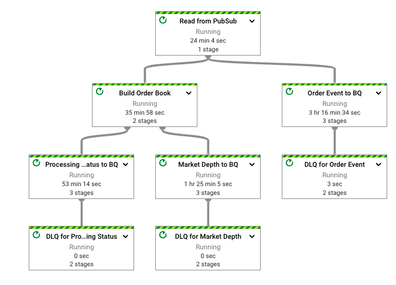

# Ordered Processing Pipeline Design

The mechanics of the ordering processing are handled by a generic `OrderedEventProcessor` transform.
It uses Apache Beam's state and timers to keep the state of processing, buffers the events that
arrived out-of-sequence and emits the processing status events.

The following are a few simple steps required to make the OrderedEventProcessor to work for a
particular use case.

## Transform the data into the shape needed by the OrderedEventProcessor

### Create the key class (if needed)

Ordered processing is done for a particular "key". Typically, there are many keys in the incoming
data. In our use case the key is the combination of session id and contract
id. [SessionContractKey](/order-book-pipeline/src/main/java/com/google/cloud/dataflow/orderbook/SessionContractKey.java)
is a class which implements both the key and its coder.

### Transform the incoming PCollection into a structured PCollection

The input PCollection for the OrderedEventProcessor needs to be in
the `KV<KeyType, <KV<Long,EventType>>` PCollection.
The key type in our case is the SessionContractKey, event type -
OrderBookEvent. [ConvertOrderBookEventToKV DoFn](/order-book-pipeline/src/main/java/com/google/cloud/dataflow/orderbook/ConvertOrderBookEventToKV.java)
puts our incoming PCollection into the required shape.

### Create a class to wrap your business logic of processing events

This class needs to
implement [MutableState interface](/beam-ordered-processing/src/main/java/org/apache/), and has to
implement two methods:

* `mutate` will be called by the OrderedEventProcessor in the ordered sequence
* `produceResult` will follow the call to `mutate` or the initial creation of the state. It can
  return NULL if there is nothing to output, or produce the result, which will be immediately output
  to the resulting PCollection.

It is implemented
in [OrderBookMutableState class](/order-book-pipeline/src/main/java/com/google/cloud/dataflow/orderbook/OrderBookMutableState.java).

### Create a class which will is used to analyse events

Besides knowing the sequence number of the event in the context of a particular key, the ordered
processor also needs to know:

* Is it the first element in the sequence? It doesn't assume that 0 or 1 is the starting sequence
  number.
* How to create the state when the initial event arrived?
* Is it the last element in the sequence? This information is useful to do some cleanup if all the
  expected elements for a given key have been processed.

This class needs to
implement [ProcessFunction<Event, State>](/beam-ordered-processing/src/main/java/org/apache/beam/sdk/extensions/ordered/EventExaminer.java).
In our demo it is implemented
by [OrderBookEventExaminer class](/order-book-pipeline/src/main/java/com/google/cloud/dataflow/orderbook/OrderBookEventExaminer.java).

### Create coders

Coders are needed by the OrderedProcessor transform to serialize and deserialize the data until it's
ready to be processed. There are three coders used by the transform:

* Mutable state
  coder - [OrderBookCoder](/order-book-pipeline/src/main/java/com/google/cloud/dataflow/orderbook/OrderBookCoder.java)
* Event coder to be used to store the buffered (out-of-sequence)
  events - [ProtoCoder in OrderBookProducer](/order-book-pipeline/src/main/java/com/google/cloud/dataflow/orderbook/OrderBookProducer.java)
* Key
  coder - [SessionContractKeyCoder in SessionContractKey class](/order-book-pipeline/src/main/java/com/google/cloud/dataflow/orderbook/SessionContractKey.java).

### Create a custom transform to wrap the OrderedEventProcessing transform

This is an optional step, and technically you don't need to do it. But if you do - the main pipeline
code will look more compact and the graph on the Dataflow UI will look "prettier". In our
demo [OrderBookProducer transform](/order-book-pipeline/src/main/java/com/google/cloud/dataflow/orderbook/OrderBookProducer.java)
is used to hide some mechanics of using the OrderedEventProcessor.

### Decide where you would like to store the results of the processing

Our demo uses BigQuery tables to store the market depths produced by the order book builder,
processing statuses output by the OrderedEventProcessor and the source order events. You
would need to code classes that tranform these classes to TableRows. An example of these class
is [MarketDepthToTableRowConverter](/order-book-pipeline/src/main/java/com/google/cloud/dataflow/orderbook/MarketDepthToTableRowConverter.java).

### Code the pipeline

The final pipeline is very simple at this point: read the sources (Google Pub/Sub subscription in
our case),
build the order book and save the
output - [OrderBookProcessingPipeline](/order-book-pipeline/src/main/java/com/google/cloud/dataflow/orderbook/OrderBookProcessingPipeline.java).

This is the pipeline graph:

## Fine print

### Duplicate processing

Currently, the processor will discard the events which have the order number lower than the
currently
processed order number. If the new event needs to be buffered the duplicate numbers won't be checked
and the processing results are unpredictable.

The number of detected duplicates will be reported in the emitted processing statuses.

### Additional Improvements

* Store only required data elements in buffered objects.
* Emit warnings on processing which misses some SLA based on the processing status PCollection
  emitted by the OrderedEventProcessor.
